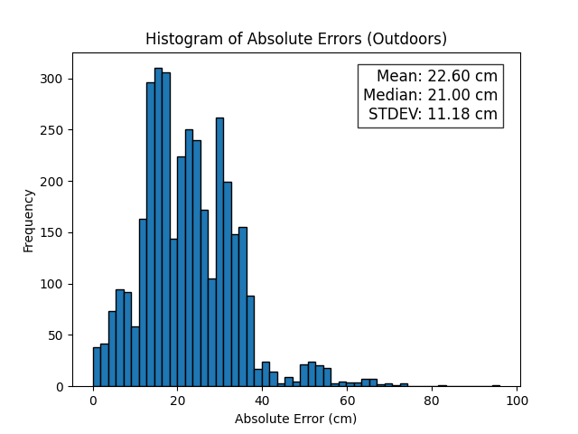
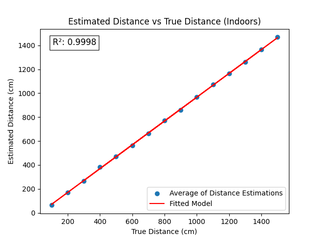

# RF-Based Ranging for Relative Localization

- To begin, we have initialized our repository to contain all of the necessary documents and API references needed for development
  - An API reference can be found in `/Doc/DW3xxx_Driver_API_Guide_6.0.14.pdf`
  - A guide for using the software development kit (SDK) can be found in `/Doc/DWM3001CDK_SDK_Developer_Guide_0.1.1.pdf`

## Connectivity List
- The vast majority of the effort on this project went into developing custom firmware for the DWM3001C boards. The first step was developing custom firmware that could measure the distance to another device. This task took the longest. The next task was to develop firmware such that one board (an initiator) can measure the distance between itself and some arbitrary amount of other boards (responders). These distances are stored in what's known as a **connectivity list**.

- We have successfully developed custom firmware to build a connectivity list. This firmware can be found at [DWM3001CDK-rf-ranging](https://github.com/owenc21/DWM3001CDK-rf-ranging)
  - The linked repository contains the custom firmware, instructions for use, and a more detailed view of what it does and how
  - Developing this firmware represents the bulk of the semester's effort

### Development Environment

- A significant portion of our effort this semester was finding a working development environment for use
- Due to compatibility issues, driver issues, and poor existing documentation, finding a suitable development environment that could be reused was very difficult
- The repository linked above, with our connectivity list firmware, provides an easy-to-use, ready-to-go development environment using Docker
- Future groups/contributors need to spend time worrying about how to configure a development environment. With Docker installed, groups/contributors can begin coding on day one in the future (a luxury we were not afforded)

## Connectivity Matrix

- In `src/distance_matrix_sim.c`, we offer a very simple simulation program that demonstrates how a connectivity matrix might be built

- In the same repository as linked above ([DWM3001CDK-rf-ranging](https://github.com/owenc21/DWM3001CDK-rf-ranging)), we also include a firmware module to build a distributed connectivity matrix
- This was the culmination of the semester's effort. It makes use of the connectivity list firmware as described above
- Currently there are some issues with the firmware
  - The devices have a strict 127 byte transmission limit, meaning a distributed data structure (like a distance/connectivity matrix) must be small. As such, the firmware currently only works for $\leq 2$ devices. However, the firmware is *correct* for an arbitrary number of devices, the devices themselves will just refuse to transmit the matrix when it has more than 2 devices
  - No error checking/correction is done, leading to inaccurate/inappropriate distance measurements (such as negative values)
- Future groups/contributors are encouraged to tackle these issues and make the firmware more efficient and robust

## Data Analysis

- Our second major priority, in addition to developing custom firmware, was to evaluate the capabilities of the DWM3001C modules

### Data Collection Methodology

- We performed two rounds of data collection (one indoors and one outdoors)
- In each environment, we measured the true distance (in increments of 1 meter), and then recorded 50-100 samples of the DWM3001C's estimated distance
- For the indoor environment, we went from `1M` to `14M`
  - Data can be found in `data/logs/10_17_2024/`
- For the outdoor environment, we went from `1M` to `30M`
  - Data can be found in `data/logs/10_25_2024/`

### Analysis and Models

- To begin, we explored the distribution of errors in each environment
  - For each measurement, we took the absolute value of the error ($abs(\text{True Distance }-\text{ Estimated Distance})$
  - We then plotted histograms of these distributions and took note of some basic descriptive statistics

- As such, we see the outdoor environment seems to have slightly less error on average but a higher variance of errors

- We then decided to see how strongly correlated the True Distance was with the Estimated Distance (in either environment)
  - We built two linear regression models on True Distance vs Estimated Distance, one for each environment

- As we see, there is a strong linear relationship for both environments, as we get a $R^2$ value of $0.9998$ and $0.9995$ for indoors and outdoors respectively, indicating near perfect correlation
- Finally, we wanted to see if there was any correlation between the error (measured by root mean squared error)
  - $RMSE=\sqrt{\displaystyle\frac{1}{n}\displaystyle\sum_{i=1}^n(D_i-\hat{D}_i)^2}$
    - $D_i$ is the true distance
    - $\hat{D}_i$ is the distance estimated by the device
- We built two linear regression models (one for each environment) for True Distance vs RMSE

- We got an $R^2$ value of $0.0470$ and $0.0135$ for the indoor and outdoor models respectively, indicating little to no linear correlation
- This corroborates all of what we've seen:
  - The devices are accurate in both environments
  - The accuracy does not increase or decrease with distance
    - Tends to be a constant offset that impacts accuracy
- The scripts for generating these models and plots can be found in the `data/` directory
  - `hist.py` is the script to generate the histograms
  - `model_accuracy.py` is the script to generate the Linear Regression models for True Distance vs RMSE (and associated plots)
  - `model_distance.py` is the script to generate the Linear Regression models for True Distance vs Estimated Distance (and associated plots)